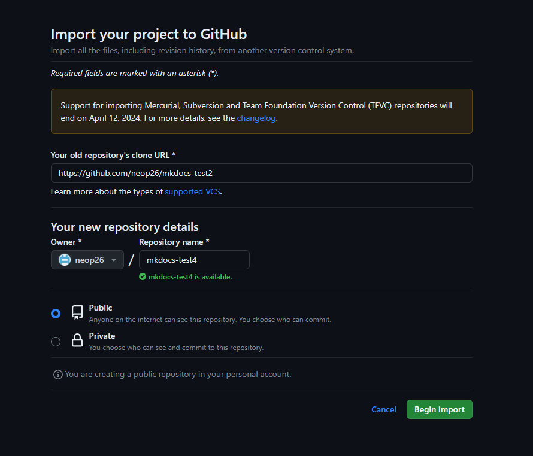
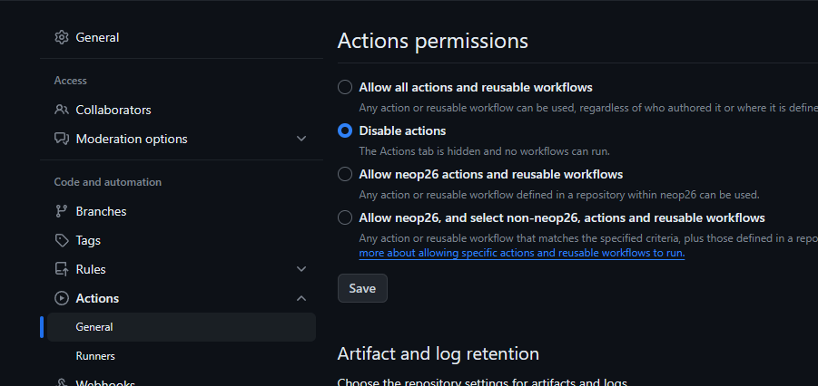
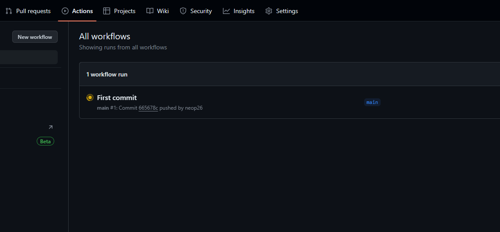
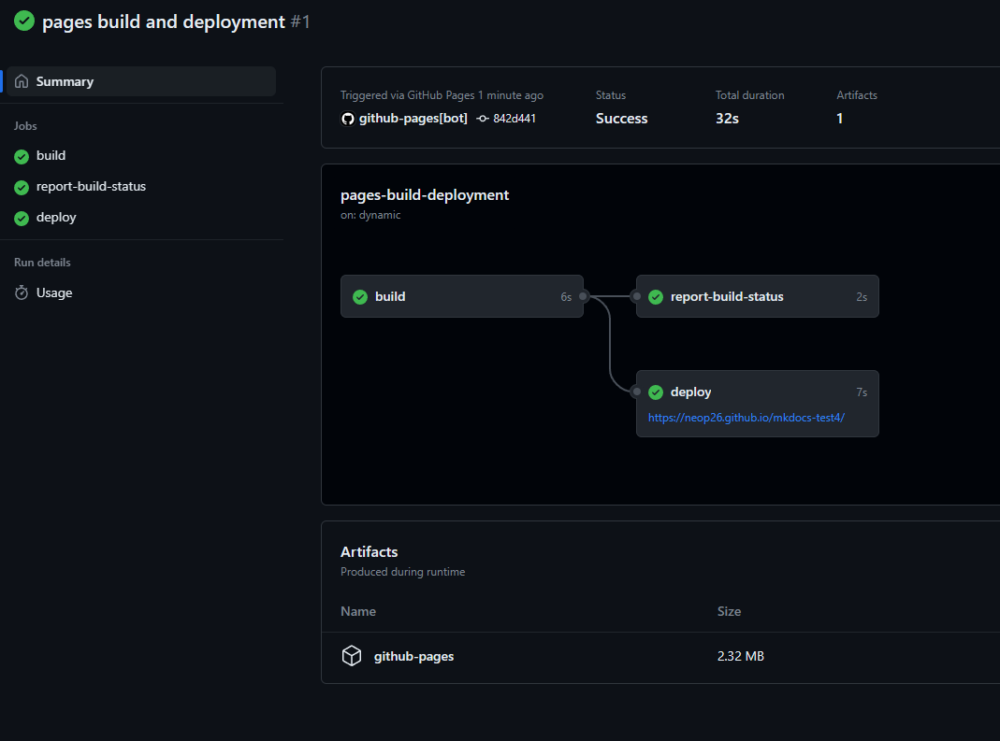

# Introduction

This repo can be copied to create a working Github Repo of MKDocs with tthe Material Theme. This repo has been inspired and is a copy of James Willett instructions on the same topic which can be found here

[Orignal Post](https://james-willett.github.io/mkdocs-material-youtube-tutorial)

# Steps to replicate

1. Create a new repo on Github by choosing to clone an existing repo and using this repo as the source.
   [Github Import](https://github.com/new/import)
   
2. Make sure the repo is public and not private if you are using a github free account.
3. Once imported, go to Settings > Actions > as shown below and click save
   
4. At this stage , clone the repo to your local machine.
5. Make changes and commit and push the changes back to the repo.
6. Workflow should now been seen as starting
   
7. Once the workflow is complete, you should be able to see the site at https://<yourusername>.github.io/<yourreponame>/
   